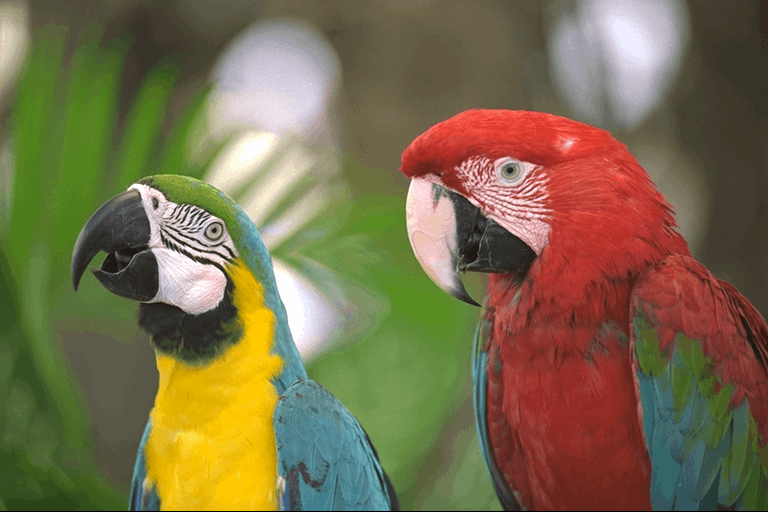
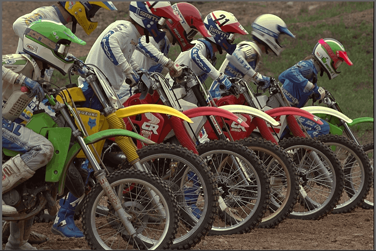

### Slower implementation of "The incremental online k-means clustering algorithm and its application to color quantization"

1) Batch K-Means (Forgy, 1965 and Lloyd, 1982)
2) Incremental Batch K-Means (Linde et al., 1980)
3) Online K-Means (MacQueen, 1967)
4) Incremental Online K-Means (Abernathy & Celebi, 2022)

---

#### Color Quantization Visualization:

Apologies for the confusion. Here is the updated table with the MSE values added next to each corresponding fish image:

Apologies for the confusion. Here's the corrected table:

Sure! Here's the updated table with the "kodim23" image:

Sure, I can add the new image "kodim05" to the table. Here are the MSE values for different color quantization levels:

MSE for iokm with 8 colors: 689.97
MSE for iokm with 16 colors: 389.18
MSE for iokm with 32 colors: 202.64
MSE for iokm with 64 colors: 110.80
MSE for iokm with 128 colors: 63.79
MSE for iokm with 256 colors: 38.18

| Original Image (24-bit)                     | K=256 (8-bit)                                          | K=128 (7-bit)                                       | K=64 (6-bit)                                       | K=32 (5-bit)                                        | K=16 (4-bit)                                        | K=8 (3-bit)                                        |
|---------------------------------------------|--------------------------------------------------------|-----------------------------------------------------|----------------------------------------------------|-----------------------------------------------------|-----------------------------------------------------|----------------------------------------------------|
|  *Fish*     |  *MSE: 33.03*    |  *MSE: 52.85* |  *MSE: 85.57* |  *MSE: 141.75* |  *MSE: 261.97* |  *MSE: 523.64* |
|  *Pills*    |  *MSE: 41.29*   |  *MSE: 66.26* |  *MSE: 111.54* |  *MSE: 200.18* |  *MSE: 363.38* |  *MSE: 710.83* |
|  *Kodim23* |  *MSE: 44.49* |  *MSE: 75.15* |  *MSE: 131.98* |  *MSE: 241.26* |  *MSE: 485.24* |  *MSE: 1017.66* |
|  *Kodim05* |  *MSE: 38.18* |  *MSE: 63.79* |  *MSE: 110.80* |  *MSE: 202.64* |  *MSE: 389.18* |  *MSE: 689.97* |

#### Cluster Visualization:

*OKM on fish.ppm (3-bit)*

*IOKM on fish.ppm (3-bit)*
